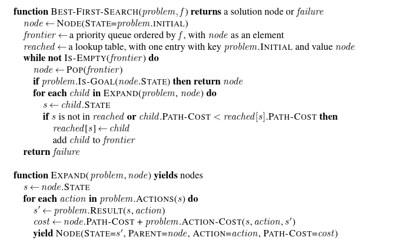

# Programming Assignment: Uninformed and Informed Search

**Submit:** `search.py` to CodeGrade

## Setup

The whole assignment runs in one conda environment. From the folder containing
`environment.yml`:

```bash
conda env create -f environment.yml
conda activate ai-search
```

Then check everything works:

```bash
python run_tests.py
```

You should see the public tests run and fail, because nothing is implemented
yet. If you instead see an import error, the environment is not active.

Reactivate with `conda activate ai-search` every time you open a new terminal.
If `environment.yml` is updated during the assignment, run
`conda env update -f environment.yml --prune`.

## Overview

You will implement four search algorithms from AIMA 4th edition — breadth-first
search, depth-first graph search, uniform-cost search, and A\* — and run them on
a road map of twenty cities.

Follow the pseudocode figures posted with this assignment. `BEST-FIRST-SEARCH`
is the general routine; UCS and A\* are that routine with different evaluation
functions, so implement it once and pass in the evaluation function rather than
writing two near-identical loops.

**Read the appendix at the end of this handout before you start.** The textbook
figures leave three things unspecified that are graded here — tie-breaking,
expansion counting, and what to do with stale queue entries — and following
`BEST-FIRST-SEARCH` literally produces the right paths with the wrong
expansion counts.

You are given `romania_map.py` and `_expected_visible.py`. **Do not modify
either.** `_expected_visible.py` holds the answers the public tests check
against — the same numbers printed in the worked-examples table below.

`romania_map.py` defines:

| Name | What it is |
|---|---|
| `GRAPH` | `dict` mapping each city to `{neighbour: cost}`. Roads are two-way. |
| `COORDS` | `dict` mapping each city to integer `(x, y)` coordinates. |

The cities carry Romanian names, but the geometry is **not** the map printed in
the textbook. Distances here are generated from `COORDS`, so numbers you
remember from lecture, or find in online AIMA repositories, will be wrong. Use
the provided file as your only source. You are free to discuss the concepts covered 
here with GenAI, however, the final submission must ONLY contain code made by YOU.

## What you may use

**Allowed, and encouraged:** `heapq` for the priority queue,
`collections.deque` or a plain `list` for the FIFO queue and the stack, and
`numpy` for the coordinate arithmetic. You do not have to write your own heap
or stack — use the standard ones and spend your time on the search logic.

**Write yourself:** the three distance functions (You can reuse them from Assignment 0) Do not call
`numpy.linalg.norm`, `math.dist`, or anything from `scipy`. The point is to
express each metric explicitly with numpy operations.

**Not allowed:** `networkx`, `scipy`, or any library that implements search or
shortest paths for you.

## What to implement

Fill in the functions in `search.py`. Do not rename them or change their
signatures.

### Distances

```python
def coords_of(city): ...      # -> length-2 numpy array of floats
def euclidean(a, b): ...      # L2
def manhattan(a, b): ...      # L1
def chebyshev(a, b): ...      # L-infinity
```

`coords_of` looks a city up in `COORDS` and returns
`np.array([x, y], dtype=float)`. The three distance functions take two such
arrays and return a `float`. Implement all three — the tests check each one
against a 3-4-5 triangle.

### `heuristic(city, goal)` — you choose

Call `coords_of` on both cities, then return the result of **one** of the three
distance functions. Which one is up to you, and it is not an arbitrary choice.

Before you code, work out for each candidate whether it can ever
**overestimate** the true cheapest cost between two cities on this map. The
fact you need is in how the map was built: every road costs
`ceil(euclidean distance)` between its endpoints' coordinates, so no road is
ever cheaper than the straight-line gap it spans. Reason from there.

If your heuristic can overestimate, it is inadmissible, A\* loses its
optimality guarantee, and it returns suboptimal paths on some city pairs. The
autograder checks A\* for optimal cost, so an inadmissible choice costs you
points on the A\* tests even when your search loop is perfect. In that case it
is not your search code that is broken.

At the top of `search.py` there is a comment block. Name your choice there and
justify it in two or three sentences: is it admissible on this map, is it
consistent, and why. This is graded by hand.

`heuristic(city, city)` must be `0.0`. Note the function takes two arguments —
a heuristic estimates distance *to the goal*, and the textbook's straight-line
table is to Bucharest only, but A\* is graded here on many different goals.

Your `astar` must **call** `heuristic(...)` rather than inlining a formula. The
autograder substitutes a zero heuristic and checks that A\* then behaves exactly
like UCS, which only works if the call is real.

### The four searches

```python
def bfs(start, goal): ...
def dfs(start, goal): ...
def ucs(start, goal): ...
def astar(start, goal): ...
```

Each returns a 3-tuple `(path, cost, expanded)`:

- **`path`** — list of city names from `start` to `goal` inclusive, e.g.
  `['Arad', 'Sibiu', 'Fagaras', 'Bucharest']`.
- **`cost`** — total cost of that path, an integer.
- **`expanded`** — how many nodes your search expanded (defined below).

### Edge cases

All four functions return `(None, None, 0)` in two situations:

- **`start` or `goal` is not a key in `GRAPH`** — an unrecognised city name.
  Guard for this first, before anything else, so you return rather than raise
  `KeyError`.
- No route connects `start` to `goal`. The supplied map is fully connected, so
  this cannot happen with it, but your code should not assume that.

When `start == goal`, all four return `([start], 0, 0)` — a one-city path, zero
cost, zero expansions.

## The rules that make your answer unique

Your output must match the autograder exactly, so these are not suggestions.

### 1. Successors in alphabetical order

Whenever you look at a city's neighbours, take them in alphabetical order:
`sorted(GRAPH[city])`.

For **DFS** this means pushing onto the stack in *reverse* alphabetical order,
so the alphabetically first neighbour is popped first.

### 2. Priority queue ties break by city name

Ties are common, not a corner case: across the graded pairs, UCS runs into
about forty exact ties. How you break them changes your expansion counts, so
this rule is graded.

Push `(f, city)` tuples onto the heap, where `f` is `path_cost` for UCS and
`path_cost + heuristic(city, goal)` for A\*. Python compares tuples
left-to-right, so equal `f` values fall back to alphabetical order on the city
name automatically.

Do **not** insert a counter to break ties:

```python
heapq.heappush(pq, (f, next(counter), city))   # WRONG - insertion order
heapq.heappush(pq, (f, city))                  # right  - alphabetical
```

### 3. Where the goal test goes

- **BFS** tests each child **as it is generated**, and returns immediately.
- **DFS** tests a node **when it is popped and expanded**.
- **UCS and A\*** test a node **when it is popped and expanded**, never at
  generation.

Goal-testing at generation in UCS or A\* is the most common way to get a path
that looks reasonable and is quietly suboptimal.

### 4. DFS never expands a city twice

Use graph search, not tree search. The authoritative rule:

> Pop a node. **If it is already in `visited`, discard it and continue.**
> Otherwise add it to `visited`, count it as expanded, goal-test it, and push
> its unvisited successors.

Mark visited **when you pop**, not when you push. These are genuinely different
algorithms here — they disagree on 71 of the 380 city pairs — and push-time
marking will fail the tests. A city may sit on the stack more than once; it is
expanded only once.

Track each node's parent alongside it on the stack — push `(child, current)` —
rather than in a shared dict, or your reconstructed path may be wrong.

Do not write DFS recursively.

### 5. Counting expansions

Increment `expanded` **each time you commit to expanding a node** — each time
you pop a node and do not discard it as already-visited or stale.

- The goal counts as an expansion for DFS, UCS, and A\* (they goal-test on
  expansion).
- The goal does *not* count for BFS (it is detected at generation, never
  expanded).
- When `start == goal`, all four return `([start], 0, 0)` — zero expansions.

### 6. Relaxation, and the one place the textbook figure differs

When you reach a city more cheaply than previously recorded, update its cost
and parent and push it again. `heapq` has no decrease-key, so the old entry
stays in the heap as a **stale** entry pointing at a worse path.

`BEST-FIRST-SEARCH` in the textbook has no closed set. When it pops a stale
entry it expands it again, generates children that all fail the improvement
test, and moves on. The path and cost still come out correct — but the node got
expanded twice.

**This assignment requires the closed set.** Keep a set of cities you have
already expanded. When you pop a city that is in it, `continue` without
counting and without expanding:

```
node <- pop(frontier)
if node.city in expanded_set: continue        # stale entry, not an expansion
add node.city to expanded_set
expanded <- expanded + 1
```


## Worked examples

All of these are in the public tests, so you can check yourself immediately.

**`Arad -> Bucharest`**

| | path | cost | expanded |
|---|---|---|---|
| BFS | Arad, Sibiu, Fagaras, Bucharest | 35 | 5 |
| DFS | Arad, Sibiu, Fagaras, Bucharest | 35 | 4 |
| UCS | Arad, Sibiu, Rimnicu Vilcea, Pitesti, Bucharest | **30** | 13 |
| A\* | Arad, Sibiu, Rimnicu Vilcea, Pitesti, Bucharest | **30** | **5** |

BFS finds the path with the fewest roads, which is *not* the cheapest. A\*
finds the same optimal path as UCS while expanding five nodes instead of
thirteen. That contrast is the point of the assignment.

**`Arad -> Craiova`**

| | path | cost | expanded |
|---|---|---|---|
| BFS | Arad, Sibiu, Rimnicu Vilcea, Craiova | 26 | 7 |
| DFS | Arad, Sibiu, Fagaras, Bucharest, Pitesti, Craiova | **48** | 7 |
| UCS | Arad, Sibiu, Rimnicu Vilcea, Craiova | 26 | 11 |
| A\* | Arad, Sibiu, Rimnicu Vilcea, Craiova | 26 | 4 or 5 |

DFS dives to Bucharest, hits the dead end at Giurgiu, backtracks, and arrives
via Pitesti at nearly twice the optimal cost. If your DFS returns 26 here, you
have written BFS.

**All six public pairs**

| pair | BFS cost/exp | DFS cost | UCS cost/exp | A\* exp |
|---|---|---|---|---|
| `Arad -> Bucharest` | 35 / 5 | 35 | 30 / 13 | 5 |
| `Arad -> Craiova` | 26 / 7 | 48 | 26 / 11 | 4 or 5 |
| `Craiova -> Sibiu` | 15 / 4 | 42 | 15 / 8 | 3 |
| `Fagaras -> Craiova` | 28 / 5 | 28 | 24 / 10 | 5 |
| `Neamt -> Drobeta` | 44 / 12 | 87 | 44 / 13 | 9 or 10 |
| `Sibiu -> Oradea` | 9 / 1 | 24 | 9 / 4 | 2 |

BFS and UCS expansion counts are fixed and graded exactly — no heuristic is
involved in either. A\* expansions **depend on which heuristic you chose**, so
the autograder accepts the count produced by any admissible choice, shown above
where they differ. The count still has to match one of them exactly: a count
that is merely small will fail. A\* path and cost are fixed regardless of
heuristic, and A\* must always return the same optimal cost as UCS.

## Testing your work

```bash
python run_tests.py              # all public tests
python run_tests.py -k astar     # just the A* tests
python run_tests.py -x           # stop at the first failure
```

The autograder runs `test_search.py` **plus a hidden set on different city
pairs**. Passing the public tests is necessary, not sufficient — but every rule
above is exercised by at least one public test, so a clean local run means you
have not silently broken one of them.

## Grading (100 points)

| | Points |
|---|---|
| Correct signatures, `start == goal`, unknown city | 6 |
| `coords_of` and the three distance functions | 10 |
| Written justification of your heuristic choice | 6 |
| BFS path, cost, expansions | 14 |
| DFS path and cost | 14 |
| UCS path, cost, expansions | 14 |
| A\* path and cost optimal on all graded pairs | 18 |
| A\* expansions match an admissible heuristic | 10 |
| A\* calls `heuristic` and beats UCS on expansions | 8 |

Each test has a **10-second timeout**. If a submission hangs, you have almost
certainly lost a visited-set check.

## Rules

Use only the standard library plus numpy. Do not install extra packages. Do not
import `networkx`, `scipy`, or any search library — the point is to write the
algorithms.

You may discuss approaches with classmates. The code you submit must be yours.
Published AIMA implementations exist online; they use different edge costs and
different tie-breaking, so copying one will fail these tests while also
violating the academic integrity policy.


---

# Appendix — the AIMA 4e figures

These are the figures posted with the assignment, reproduced for reference.
Each is followed by the changes you must make for this assignment. **None of
the three figures, as printed, produces the expected output.** That is not a
criticism of the book — the figures describe families of algorithms, and this
assignment pins down choices the book deliberately leaves open.

## GRAPH-SEARCH

__function__ GRAPH-SEARCH(_problem_) __returns__ a solution, or failure

&emsp;_frontier_ &larr; a queue initially containing one path, for the _problem_'s initial state

&emsp;_reached_ &larr; a table of {_state_: _node_}; initially empty

&emsp;_solution_ &larr; failure

&emsp;__while__  _frontier_ is not empty __and__ _solution_ can possibly be improved __do__

&emsp;&emsp;&emsp;_parent_ &larr; some node that we choose to remove from _frontier_

&emsp;&emsp;&emsp;__for__ _child_ __in__ EXPAND(_parent_) __do__

&emsp;&emsp;&emsp;&emsp;&emsp;_s_ &larr; _child_.state

&emsp;&emsp;&emsp;&emsp;&emsp;__if__ _s_ is not in _reached_  __or__ _child_ is a cheaper path than _reached_[_s_] __then__

&emsp;&emsp;&emsp;&emsp;&emsp;&emsp;&emsp;_reached_[_s_] &larr; _child_

&emsp;&emsp;&emsp;&emsp;&emsp;&emsp;&emsp;add _child_ to _frontier_

&emsp;&emsp;&emsp;&emsp;&emsp;&emsp;&emsp;__if__ _s_ is a goal and _child_ is cheaper than _solution_ __then__

&emsp;&emsp;&emsp;&emsp;&emsp;&emsp;&emsp;&emsp;&emsp;_solution_  =  _child_

&emsp;__return__ _solution_

**What to change.** This is the general template, not a runnable algorithm.
Three things are left to you, and all three are graded:

1. *"some node that we choose to remove"* — for UCS and A\* that is the minimum
   `f`, with ties broken alphabetically by city name (rule 2).
2. The order of `EXPAND` — alphabetical here (rule 1).
3. It has no notion of counting expansions (rule 5).

There is also a structural difference. This template keeps improving a
best-solution-so-far and goal-tests **children as they are generated**. This
assignment requires UCS and A\* to goal-test the node **when it is popped**, and
to return immediately (rule 3). With a consistent heuristic the first popped
goal is already optimal, so the extra bookkeeping is unnecessary — but if you
keep it, your expansion counts will be wrong.

## BREADTH-FIRST-SEARCH (Figure 3.9)

__function__ BREADTH-FIRST-SEARCH(_problem_) __returns__ a solution, or failure

&emsp;__if__ problem's initial state is a goal __then return__ empty path to initial state

&emsp;_frontier_ &larr; a FIFO queue initially containing one path, for the _problem_'s initial state

&emsp;_reached_ &larr; a set of states; initially empty

&emsp;_solution_ &larr; failure

&emsp;__while__  _frontier_ is not empty __do__

&emsp;&emsp;&emsp;_parent_ &larr; the first node in _frontier_

&emsp;&emsp;&emsp;__for__ _child_ __in__ successors(_parent_) __do__

&emsp;&emsp;&emsp;&emsp;&emsp;_s_ &larr; _child_.state

&emsp;&emsp;&emsp;&emsp;&emsp;__if__ _s_ is a goal  __then__

&emsp;&emsp;&emsp;&emsp;&emsp;&emsp;&emsp;__return__  _child_

&emsp;&emsp;&emsp;&emsp;&emsp;__if__ _s_ is not in _reached_ __then__

&emsp;&emsp;&emsp;&emsp;&emsp;&emsp;&emsp;add _s_ to _reached_

&emsp;&emsp;&emsp;&emsp;&emsp;&emsp;&emsp;add _child_ to the end of _frontier_

&emsp;__return__  _solution_

**What to change.** The goal test is in the right place — on the child, at
generation (rule 3). Two fixes are needed:

1. *"the first node in frontier"* must be **removed** from the frontier, not
   merely read. Otherwise the loop never terminates.
2. **`reached` starts empty, so the start city is never marked.** On this map
   that is not a harmless inefficiency. Transcribed literally,
   `Arad -> Bucharest` expands `Arad, Sibiu, Timisoara, Zerind, Arad, Fagaras` —
   Arad is expanded a second time as a child of its own neighbours. That
   overwrites Arad's parent pointer, which puts a cycle in the parent chain, and
   rebuilding the path from the goal then loops forever. The assignment's
   10-second timeout will kill it.

   Mark the start city as reached **before** the loop begins. The cleanest way
   is to seed your parent table with `{start: None}` and use membership in that
   table as your reached test — one structure doing both jobs.

## BEST-FIRST-SEARCH (Figure 3.7)



**What to change.** `BEST-FIRST-SEARCH` has **no closed set**. Because `heapq`
has no decrease-key, improved paths are pushed as new entries and the old,
stale entries stay in the queue. The figure pops those stale entries and
expands them again. The children all fail the improvement test, so the path and
cost still come out correct — but the node was expanded twice.

Add a closed set and skip stale pops without counting them (rule 6). Without
it, expansion counts are too high on 7 of the 17 graded pairs.
`Fagaras -> Craiova` is 10 with the closed set and 11 without, and it is in the
public tests.

## Depth-first graph search — no textbook figure exists

The book gives no graph-search DFS figure; Figure 3.12 covers the depth-limited
and iterative-deepening variants instead. So unlike the three above, there is
nothing to adapt — this one is specified entirely by rule 4, and the pseudocode
is given here in full.

The goal test sits on the **popped** node, so the goal does count as an
expansion. Successors are pushed in *reverse* alphabetical order so the
alphabetically first is popped first. Parents ride on the stack rather than
being written to a shared dict at push time. `successors(city)` means
`sorted(GRAPH[city])`. The unknown-city guard from the Edge cases section is
omitted here for brevity; you still need it.

```
function DFS(start, goal) returns (path, cost, expanded)
    if start = goal then return ([start], 0, 0)
    stack    <- LIFO stack containing the pair (start, None)
    parent   <- empty dict
    visited  <- empty set
    expanded <- 0
    while stack is not empty do
        (city, its_parent) <- POP(stack)
        if city in visited then continue          # already expanded, skip
        add city to visited
        parent[city] <- its_parent
        expanded <- expanded + 1
        if city = goal then
            path <- REBUILD(parent, goal)
            return (path, COST-OF(path), expanded)
        for each child in REVERSE(successors(city)) do
            if child not in visited then
                push (child, city) onto stack
    return (None, None, expanded)
```

`REBUILD` walks parent pointers from the goal back to the start and reverses
the result. It terminates only if the parent chain is acyclic, which is why the
start city's parent must be `None` and must never be overwritten — the same
trap described under Figure 3.9 above.
